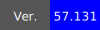

# call-py-script-workflow    
Sample repo that calls a python script in workflow.   
----
### DEV
|  |  | 
|------------------------------------------------|----------------------------------------|
###
|  |  | 
|------------------------------------------------|----------------------------------------|
