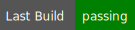

# call-py-script-workflow    
Sample repo that calls a python script in workflow.   
----

----
|  | 
|------------------------------------------------------------------------------------------------------------------------|

